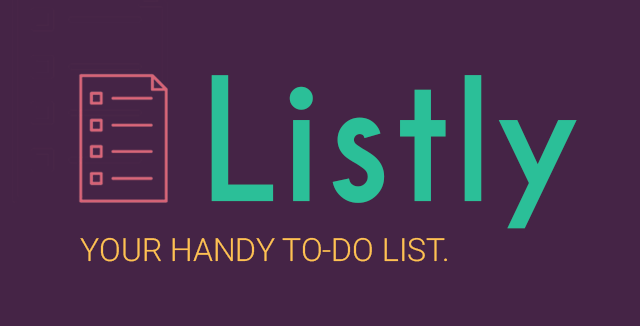

# Listly

A to-do list app for Android.

**Completed Features:**

 * [x] *Required*: Add task
 * [x] *Required*: Edit task
 * [x] *Required*: Delete task
 * [x] *Required*: Restore previously persisted items when app restarts 
 * [x] *Extra*: Persist task items into SQLite instead of a text file 
 * [x] *Extra*: Styled UI (e.g. iconography, custom logo/branding, colors, typography) and custom launch screen design
 * [x] *Extra*: Set completion due dates for tasks 
 * [x] *Extra*: Set priority levels for tasks and display within ListView item
 * [x] *Extra*: Custom adapter for improved style of tasks within ListView
 * [x] *Extra*: Editable notes field for attaching longer descriptions/notes per task
 * [x] *Extra*: Dialog box prompts for user cancellation / deletion actions
 * [x] *Extra*: Adaptive to different screen orientations (landscape vs. portrait)
 * [x] *Extra*: MVP app structure

**App Structure:**

I chose to structure my app using the Model-View-Presenter (MVP) pattern to separate the presentation layer from the logic.

 * MODEL: 
 `Task`, `Database` (these provide data to display in the View)
 * VIEW: 
 `AllTasksActivity`, `EditTaskActivity`, `TaskDetailActivity`, `CustomTaskAdapter`, `SplashScreen` (these call methods from the Presenter for interface actions)
 * PRESENTER: 
 `ActivityManager`, `ConfirmActionDialog` (these retrieve data from the Model to return to the View, acting as a middleman):

**Note:**

The prework instructions said to set minSDKVersion to API 14 when generating the project, but the Quickstart Slides said to set it to API 4.1 (Jelly Bean). I just chose to follow the prework instructions.

**Logo and Branding:**

**GIF walkthrough of all required and optional stories:**

GIF created with [LiceCap](http://www.cockos.com/licecap/)
